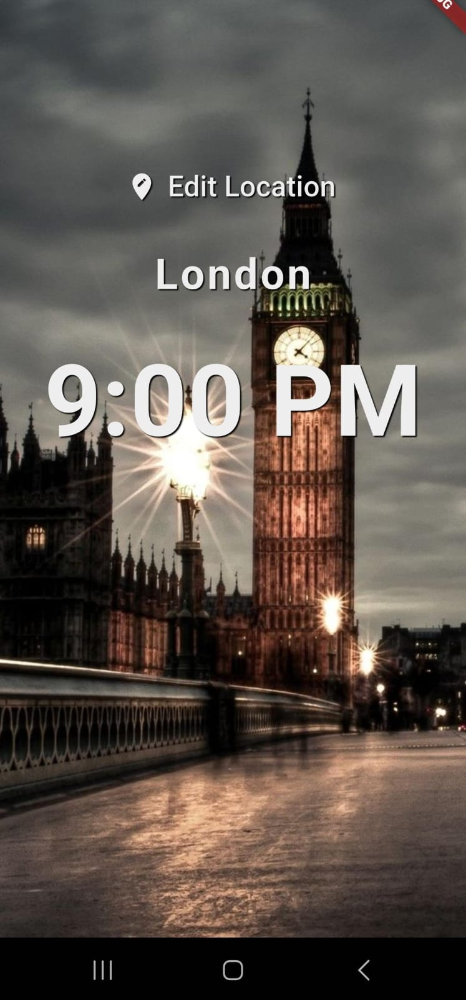
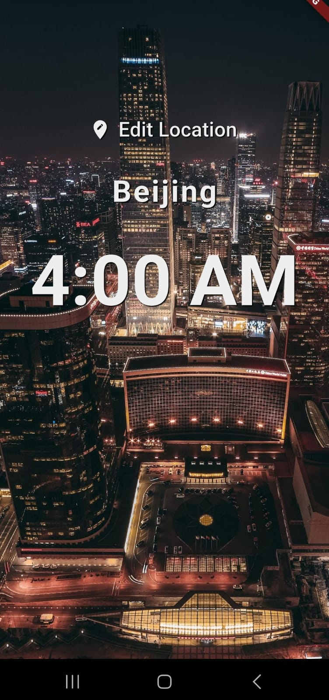

# World Time Flutter App

This project is a Flutter app that shows the time in various locations around the world. The background images change depending on the location and the time of day in that location.

The app was created as part of a Flutter training, with tutorials and inspiration taken from the Flutter tutorials by the Net Ninja channel on YouTube.

